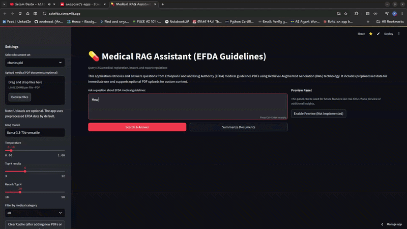

# AskEFDA



AI-powered RAG assistant for querying Ethiopian Food and Drug Authority (EFDA) medical guidelines using natural language.

Built with LangChain, FAISS/BM25 hybrid retrieval, Groq LLMs, and Streamlit.

---

## Features

- Hybrid Retrieval (FAISS + BM25)
- Cross-Encoder Reranking
- Conversational Memory
- PDF Upload Support
- Summarization Mode
- Streamlit Interface
- Fast Responses with Groq API
- Context-Aware Answers from EFDA Guidelines

---

## Architecture

```text
PDF Documents
      ↓
 Document Chunking
      ↓
Embeddings + BM25 Indexing
      ↓
 Hybrid Retrieval
      ↓
 Cross-Encoder Reranking
      ↓
     Groq LLM
      ↓
 Context-Aware Response
```

---

## Tech Stack

| Category | Tools |
|---|---|
| Framework | LangChain |
| UI | Streamlit |
| LLM | Groq (Llama 3.3 70B) |
| Embeddings | Hugging Face all-MiniLM-L6-v2 |
| Retrieval | FAISS + BM25 |
| Reranker | cross-encoder/ms-marco-MiniLM-L-6-v2 |
| PDF Processing | PyPDF2 |

---

## Project Structure

```bash
.
├── helpers/
│   ├── chain.py
│   ├── chunker.py
│   ├── pdfloader.py
│   ├── retriever.py
│   └── vectorstore.py
├── app.py
├── process_pdfs.py
├── requirements.txt
├── README.md
└── .env
```

---

## Installation

### 1. Clone the Repository

```bash
git clone https://github.com/anaboset/Medical-RAG-Assistant.git
cd Medical-RAG-Assistant
```

### 2. Create a Virtual Environment

```bash
python -m venv venv
```

Activate the environment:

#### Linux/macOS

```bash
source venv/bin/activate
```

#### Windows

```bash
venv\Scripts\activate
```

---

### 3. Install Dependencies

```bash
pip install -r requirements.txt
```

---

### 4. Configure Environment Variables

Create a `.env` file in the project root:

```env
GROQ_API_KEY=your_groq_api_key
```

Get your API key from:

https://console.groq.com/

---

## Run the Application

```bash
streamlit run app.py
```

---

## Preprocessing PDFs

To create FAISS and BM25 indexes from your PDF documents:

```bash
python process_pdfs.py
```

This generates:

- `chunks.pkl`
- `chunks_faiss_store/`
- `chunks_bm25.pkl`

---

## Example Queries

- “What is the process for registering a new medicine in Ethiopia?”
- “What are the import regulations for pharmaceuticals?”
- “Summarize EFDA medicine registration guidelines.”

---

## How It Works

1. PDF documents are loaded and chunked.
2. Embeddings are generated using Hugging Face models.
3. FAISS and BM25 indexes are created.
4. Hybrid retrieval fetches relevant chunks.
5. A cross-encoder reranks the results.
6. Groq LLM generates a context-aware answer.

---

## Future Improvements

- Multilingual Support (Amharic)
- Knowledge Graph Integration
- Advanced Query Rewriting
- Real-Time Regulatory Updates
- Improved Retrieval Optimization

---

## Deployment

The application can be deployed easily using Streamlit Cloud.

1. Push the repository to GitHub
2. Connect the repository to Streamlit Cloud
3. Add `GROQ_API_KEY` in Streamlit secrets
4. Deploy

---

## Disclaimer

This project provides information from EFDA medical guidelines and should not be considered professional medical or legal advice.

---

## Author

Developed by:

- AI Engineer & Pharmacy Student
- Passionate about AI for Healthcare

---

## License

MIT License